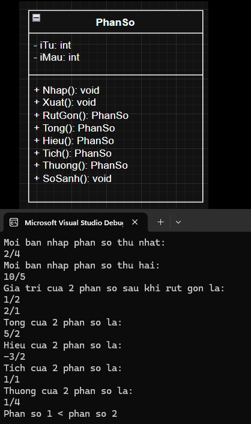
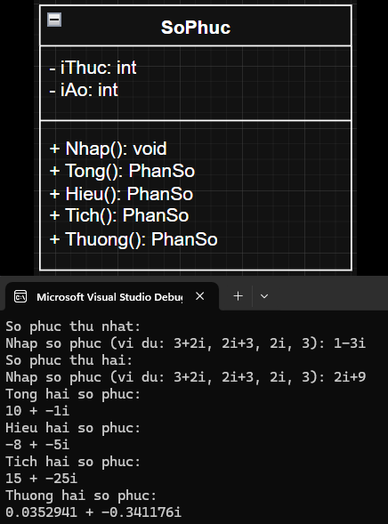
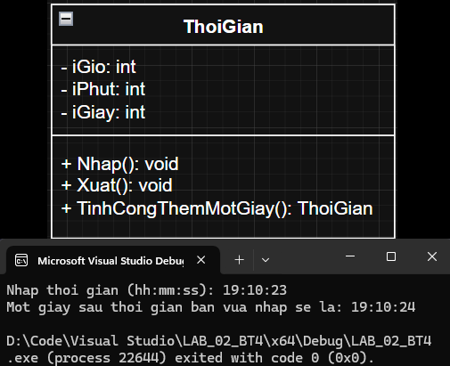

# LAB 02

## Bảng nội dung
- [Bài Tập 1](#bài-tập-1)
- [Bài Tập 2](#bài-tập-2)
- [Bài Tập 3](#bài-tập-3)
- [Bài Tập 4](#bài-tập-4)

---

## Bài Tập 1
### [Header](https://github.com/zr0x8/IT002.P22/tree/main/LAB_02/1/Header/Date.h)
<details>
<summary>Xem trước</summary>
  
```cpp
#pragma once
class Date
{
	private:
		int iNgay;
		int iThang;
		int iNam;
	public:
		Date();
		Date(int iNgay, int iThang, int iNam);
		Date(const Date& d);
		~Date();
		//getters
		void Nhap();
		void Xuat() const;
		//misc
		Date NgayThangNamTiepTheo();
		//op overload
		Date& operator=(const Date& d);
};
```

</details>

### [Triển khai](https://github.com/zr0x8/IT002.P22/tree/main/LAB_02/1/Implementation/Date.cpp)
<details>
<summary>Xem trước</summary>
  
```cpp
#include "Date.h"

#include <iostream>

Date::Date() : iNgay(1), iThang(1), iNam(1970) {};
Date::Date(int Ngay, int Thang, int Nam) : iNgay(Ngay), iThang(Thang), iNam(Nam) {};
Date::Date(const Date& other) : iNgay(other.iNgay), iThang(other.iThang), iNam(other.iNam) {};
Date::~Date() {};

void Date::Nhap() {
	char holder;
	std::cout << "Nhap ngay thang nam cua ban (dd mm yyyy): ";
	std::cin >> iNgay >> holder >> iThang >> holder >> iNam;
	std::cout << "Ngay thang nam da nhap: " << iNgay << holder << iThang << holder << iNam << '\n';
}

void Date::Xuat() const {
	std::cout << "Ngay thang nam da nhap: " << iNgay << '/' << iThang << '/' << iNam << '\n';
}

Date& Date::operator=(const Date& other) {
	if (this != &other) {
		iNgay = other.iNgay;
		iThang = other.iThang;
		iNam = other.iNam;
	}
	return *this;
}

Date Date::NgayThangNamTiepTheo() {
	int SoNgayTrongThang[] = { 0, 31, 28, 31, 30, 31, 30, 31, 31, 30, 31, 30, 31 };
	if (iNam % 4 == 0 && iNam % 100 != 0 || iNam % 400 == 0) {
		SoNgayTrongThang[2] = 29;
	}
	Date mai = *this;
	if (iNgay < SoNgayTrongThang[iThang]) {
		mai.iNgay++;
	} else {
		mai.iNgay = 1;
		if (iThang < 12) {
			mai.iThang++;
		} else {
			mai.iThang = 1;
			mai.iNam++;
		}
	}
	return mai;
}
```
</details>

### [Chương trình gốc](https://github.com/zr0x8/IT002.P22/tree/main/LAB_02/1/LAB_02_BT1.cpp)
<details>
<summary>Xem trước</summary>
  
```cpp
#include "Date.h"

#include <iostream>

int main() {
	Date hehe; //chua thong tin nguoi dung nhap
	hehe.Nhap();
	std::cout << "Ngay tiep theo la: ";
	hehe.NgayThangNamTiepTheo().Xuat();
	std::cout << "Bye bye\n";
	return 0;
}
```

</details>

### Class Diagram và kiểm thử
<details>
<summary>Ẩn/hiện</summary>
  


</details>

## Bài Tập 2
### [Header](https://github.com/zr0x8/IT002.P22/tree/main/LAB_02/2/Header/PhanSo.h)
<details>
<summary>Xem trước</summary>
  
```cpp
#pragma once
class PhanSo
{
	private:
		int iTu;
		int iMau;
	public:
		PhanSo();
		PhanSo(int iTu, int iMau);
		PhanSo(const PhanSo& ps);
		~PhanSo();
		//set getters
		void Nhap();
		void Xuat() const;
		//misc
		PhanSo RutGon() const;
		PhanSo Tong(const PhanSo& ps) const;
		PhanSo Hieu(const PhanSo& ps) const;
		PhanSo Tich(const PhanSo& ps) const;
		PhanSo Thuong(const PhanSo& ps) const;
		void SoSanh(const PhanSo& ps) const;

};
```

</details>

### [Triển khai](https://github.com/zr0x8/IT002.P22/tree/main/LAB_02/2/Implementation/PhanSo.cpp)
<details>
<summary>Xem trước</summary>
  
```cpp
#include "PhanSo.h"

#include <iostream>

int GCD(const int& a, const int& b) {
	if (b == 0) return a;
	return GCD(b, a % b);
}

PhanSo::PhanSo() : iTu(0), iMau(1) {};
PhanSo::PhanSo(int tu, int mau) : iTu(tu), iMau(mau) {
	if (iMau == 0) {
		iMau = 1;
	}
};
PhanSo::PhanSo(const PhanSo& ps) : iTu(ps.iTu), iMau(ps.iMau) {};

PhanSo::~PhanSo() {};

void PhanSo::Nhap() {
	char holder;
	do {
		std::cin >> iTu >> holder >> iMau;
		if (iMau == 0) {
			std::cout << "Phan so khong hop le, vui long nhap lai: \n";
		}
	} while (iMau == 0);
}

void PhanSo::Xuat() const {
	std::cout << iTu << "/" << iMau << '\n';
}

PhanSo PhanSo::RutGon() const {
	int gcd = GCD(abs(iTu), abs(iMau));
	if (gcd == 0) return PhanSo(0, 1);
	if (gcd == 1) return *this;
	return PhanSo(iTu / gcd, iMau / gcd);
}

PhanSo PhanSo::Tong(const PhanSo& ps) const {
	return PhanSo(iTu * ps.iMau + ps.iTu * iMau, iMau * ps.iMau).RutGon();
}

PhanSo PhanSo::Hieu(const PhanSo& ps) const {
	PhanSo ket_qua;

	return PhanSo(iTu * ps.iMau - ps.iTu * iMau, iMau * ps.iMau).RutGon();
}

PhanSo PhanSo::Tich(const PhanSo& ps) const {
	return PhanSo(iTu * ps.iTu, iMau * ps.iMau).RutGon();
}

PhanSo PhanSo::Thuong(const PhanSo& ps) const {
	return PhanSo(iTu * ps.iMau, iMau * ps.iTu).RutGon();
}

void PhanSo::SoSanh(const PhanSo& ps) const {
	double ps1 = this->iTu / this->iMau;
	double ps2 = ps.iTu / ps.iMau;
	if (ps1 > ps2) {
		std::cout << "Phan so 1 > phan so 2\n";
	}
	else if (ps1 < ps2) {
		std::cout << "Phan so 1 < phan so 2\n";
	}
	else {
		std::cout << "Phan so 1 = phan so 2\n";
	}
}


```
</details>

### [Chương trình gốc](https://github.com/zr0x8/IT002.P22/tree/main/LAB_02/2/LAB_02_BT2.cpp)
<details>
<summary>Xem trước</summary>
  
```cpp
#include <iostream>

#include "PhanSo.h"

int main() {
	PhanSo ps1;
	PhanSo ps2;
	std::cout << "Moi ban nhap phan so thu nhat: \n";
	ps1.Nhap();
	std::cout << "Moi ban nhap phan so thu hai: \n";
	ps2.Nhap();
	std::cout << "Gia tri cua 2 phan so sau khi rut gon la:\n";
	ps1.RutGon().Xuat();
	ps2.RutGon().Xuat();
	std::cout << "Tong cua 2 phan so la:\n";
	ps1.Tong(ps2).Xuat();
	std::cout << "Hieu cua 2 phan so la:\n";
	ps1.Hieu(ps2).Xuat();
	std::cout << "Tich cua 2 phan so la:\n";
	ps1.Tich(ps2).Xuat();
	std::cout << "Thuong cua 2 phan so la:\n";
	ps1.Thuong(ps2).Xuat();
	ps1.SoSanh(ps2);
}
```

</details>

### Class Diagram và kiểm thử
<details>
<summary>Ẩn/hiện</summary>
  


</details>

## Bài Tập 3
### [Header](https://github.com/zr0x8/IT002.P22/tree/main/LAB_02/3/Header/SoPhuc.h)
<details>
<summary>Xem trước</summary>
  
```cpp
#pragma once
class SoPhuc
{
	private:
		float iThuc;
		float iAo;
	public:
		SoPhuc();
		SoPhuc(float thuc, float ao);
		SoPhuc(const SoPhuc& sp);
		~SoPhuc();

		void Nhap();
		void Xuat() const;
		SoPhuc Tong(const SoPhuc& sp) const;
		SoPhuc Hieu(const SoPhuc& sp) const;
		SoPhuc Tich(const SoPhuc& sp) const;
		SoPhuc Thuong(const SoPhuc& sp) const;
};
```

</details>

### [Triển khai](https://github.com/zr0x8/IT002.P22/tree/main/LAB_02/3/Implementation/SoPhuc.cpp)
<details>
<summary>Xem trước</summary>
  
```cpp
#include "SoPhuc.h"

#include <iostream>
#include <string>

SoPhuc::SoPhuc() : iThuc(0), iAo(0) {};
SoPhuc::SoPhuc(float thuc, float ao) : iThuc(thuc), iAo(ao) {};
SoPhuc::SoPhuc(const SoPhuc& sp) : iThuc(sp.iThuc), iAo(sp.iAo) {};

SoPhuc::~SoPhuc() {};

void SoPhuc::Nhap() {
    std::string input;
    std::cout << "Nhap so phuc (vi du: 3+2i, 2i+3, 2i, 3): ";
    std::cin >> input;

    if (input.find('i') == std::string::npos) {
        iThuc = std::stoi(input);
        iAo = 0;
        return;
    }

    if (input.find('+') == std::string::npos && input.find('-', 1) == std::string::npos) {
        if (input == "i") {
            iThuc = 0;
            iAo = 1;
        } else if (input == "-i") {
            iThuc = 0;
            iAo = -1;
        } else {
            input.pop_back();
            iThuc = 0;
            iAo = std::stoi(input);
        }
        return;
    }

    size_t i_position = input.find('i');
    size_t plus_position = input.find('+');
    size_t minus_position = input.find('-', 1);

    size_t position = std::string::npos;
    if (plus_position != std::string::npos)
        position = plus_position;
    else if (minus_position != std::string::npos)
        position = minus_position;

    if (i_position > position && position != std::string::npos) {
        std::string real = input.substr(0, position);
        std::string unreal = input.substr(position, i_position - position);
        
        iThuc = real.empty() ? 0 : std::stoi(real);
        iAo = (unreal == "+" || unreal == "-") ? 
              (unreal == "+" ? 1 : -1) : std::stoi(unreal);
    }
    // Xử lý trường hợp "bi+a"
    else if (i_position < position) {
        std::string unreal = input.substr(0, i_position);
        std::string real = input.substr(position);
        
        iThuc = std::stoi(real);
        iAo = unreal.empty() ? 1 : (unreal == "-" ? -1 : std::stoi(unreal));
    }
}


void SoPhuc::Xuat() const {
	std::cout << iThuc << " + " << iAo << "i" << std::endl;
}

SoPhuc SoPhuc::Tong(const SoPhuc& sp) const {
    return SoPhuc(iThuc + sp.iThuc, iAo + sp.iAo);
}

SoPhuc SoPhuc::Hieu(const SoPhuc& sp) const {
    return SoPhuc(iThuc - sp.iThuc, iAo - sp.iAo);
}

SoPhuc SoPhuc::Tich(const SoPhuc& sp) const {
    return SoPhuc(iThuc * sp.iThuc - iAo * sp.iAo, iThuc * sp.iAo + iAo * sp.iThuc);
}

SoPhuc SoPhuc::Thuong(const SoPhuc& sp) const {
    int chia = sp.iThuc * sp.iThuc + sp.iAo * sp.iAo;
    return SoPhuc((iThuc * sp.iThuc + iAo * sp.iAo) / chia, (iAo * sp.iThuc - iThuc * sp.iAo) / chia);
}
```
</details>

### [Chương trình gốc](https://github.com/zr0x8/IT002.P22/tree/main/LAB_02/3/LAB_02_BT3.cpp)
<details>
<summary>Xem trước</summary>
  
```cpp
#include "SoPhuc.h"
#include <iostream>

int main() {
	SoPhuc sp1, sp2;
	std::cout << "So phuc thu nhat: \n";
	sp1.Nhap();
	std::cout << "So phuc thu hai: \n";
	sp2.Nhap();
	std::cout << "Tong hai so phuc: \n";
	sp1.Tong(sp2).Xuat();
	std::cout << "Hieu hai so phuc: \n";
	sp1.Hieu(sp2).Xuat();
	std::cout << "Tich hai so phuc: \n";
	sp1.Tich(sp2).Xuat();
	std::cout << "Thuong hai so phuc: \n";
	sp1.Thuong(sp2).Xuat();
}
```

</details>

### Class Diagram và kiểm thử
<details>
<summary>Ẩn/hiện</summary>
  


</details>

## Bài Tập 4
### [Header](https://github.com/zr0x8/IT002.P22/tree/main/LAB_02/4/Header/ThoiGian.h)
<details>
<summary>Xem trước</summary>
  
```cpp
#pragma once
class ThoiGian
{
	private:
		int iGio, iPhut, iGiay;
	public:
		ThoiGian();
		ThoiGian(int gio, int phut, int giay);
		ThoiGian(const ThoiGian& tg);
		~ThoiGian();

		void Nhap();
		void Xuat() const;

		ThoiGian TinhCongThemMotGiay();
};
```

</details>

### [Triển khai](https://github.com/zr0x8/IT002.P22/tree/main/LAB_02/4/Implementation/ThoiGian.cpp)
<details>
<summary>Xem trước</summary>
  
```cpp
#include "ThoiGian.h"

#include <iostream>

ThoiGian::ThoiGian() : iGio(0), iPhut(0), iGiay(0) {};
ThoiGian::ThoiGian(int gio, int phut, int giay) : iGio(gio), iPhut(phut), iGiay(giay) {};
ThoiGian::ThoiGian(const ThoiGian& tg) : iGio(tg.iGio), iPhut(tg.iPhut), iGiay(tg.iGiay) {};

ThoiGian::~ThoiGian() {};

void ThoiGian::Nhap() {
	char holder;
	std::cout << "Nhap thoi gian (hh:mm:ss): ";
	std::cin >> iGio >> holder >> iPhut >> holder >> iGiay;
}

void ThoiGian::Xuat() const {
	std::cout << iGio << ":" << iPhut << ":" << iGiay << std::endl;
}

ThoiGian ThoiGian::TinhCongThemMotGiay() {
	ThoiGian tg(*this);
	tg.iGiay++;
	if (tg.iGiay >= 60) {
		tg.iGiay = 0;
		tg.iPhut++;
		if (tg.iPhut >= 60) {
			tg.iPhut = 0;
			tg.iGio++;
			if (tg.iGio >= 24) {
				tg.iGio = 0;
			}
		}
	}
	return tg;
}
```
</details>

### [Chương trình gốc](https://github.com/zr0x8/IT002.P22/tree/main/LAB_02/4/LAB_02_BT4.cpp)
<details>
<summary>Xem trước</summary>
  
```cpp
#include "ThoiGian.h"

#include <iostream>
int main() {
	ThoiGian tg;
	tg.Nhap();
	std::cout << "Mot giay sau thoi gian ban vua nhap se la: ";
	tg.TinhCongThemMotGiay().Xuat();
	return 0;
}
```

</details>

### Class Diagram và kiểm thử
<details>
<summary>Ẩn/hiện</summary>
  


</details>

