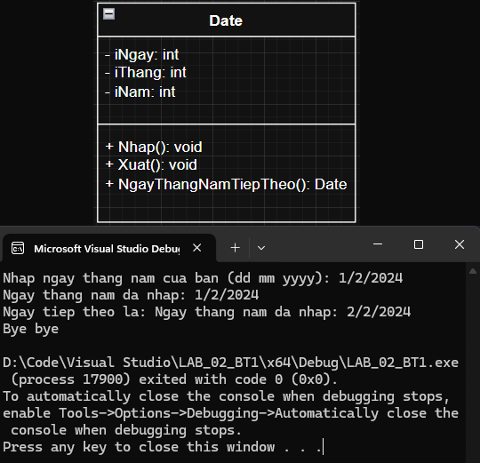

# LAB_02 Overview

## Table of Contents
- [Bài Tập 1](#bài-tập-1)
- [Bài Tập 2](#bài-tập-2)
- [Bài Tập 3](#bài-tập-3)
- [Bài Tập 4](#bài-tập-4)

---

## Bài Tập 1
### [Header](https://github.com/zr0x8/IT002.P22/tree/main/LAB_02/1/Header/Date.h)
<details>
<summary>Xem trước</summary>
  
```cpp
#pragma once
class Date
{
	private:
		int iNgay;
		int iThang;
		int iNam;
	public:
		Date();
		Date(int iNgay, int iThang, int iNam);
		Date(const Date& d);
		~Date();
		//getters
		void Nhap();
		void Xuat() const;
		//misc
		Date NgayThangNamTiepTheo();
		//op overload
		Date& operator=(const Date& d);
};
```

</details>

### [Triển khai](https://github.com/zr0x8/IT002.P22/tree/main/LAB_02/1/Implementation/Date.cpp)
<details>
<summary>Xem trước</summary>
  
```cpp
#include "Date.h"

#include <iostream>

Date::Date() : iNgay(1), iThang(1), iNam(1970) {};
Date::Date(int Ngay, int Thang, int Nam) : iNgay(Ngay), iThang(Thang), iNam(Nam) {};
Date::Date(const Date& other) : iNgay(other.iNgay), iThang(other.iThang), iNam(other.iNam) {};
Date::~Date() {};

void Date::Nhap() {
	char holder;
	std::cout << "Nhap ngay thang nam cua ban (dd mm yyyy): ";
	std::cin >> iNgay >> holder >> iThang >> holder >> iNam;
	std::cout << "Ngay thang nam da nhap: " << iNgay << holder << iThang << holder << iNam << '\n';
}

void Date::Xuat() const {
	std::cout << "Ngay thang nam da nhap: " << iNgay << '/' << iThang << '/' << iNam << '\n';
}

Date& Date::operator=(const Date& other) {
	if (this != &other) {
		iNgay = other.iNgay;
		iThang = other.iThang;
		iNam = other.iNam;
	}
	return *this;
}

Date Date::NgayThangNamTiepTheo() {
	int SoNgayTrongThang[] = { 0, 31, 28, 31, 30, 31, 30, 31, 31, 30, 31, 30, 31 };
	if (iNam % 4 == 0 && iNam % 100 != 0 || iNam % 400 == 0) {
		SoNgayTrongThang[2] = 29;
	}
	Date mai = *this;
	if (iNgay < SoNgayTrongThang[iThang]) {
		mai.iNgay++;
	} else {
		mai.iNgay = 1;
		if (iThang < 12) {
			mai.iThang++;
		} else {
			mai.iThang = 1;
			mai.iNam++;
		}
	}
	return mai;
}
```
</details>

### [Chương trình gốc](https://github.com/zr0x8/IT002.P22/tree/main/LAB_02/1/LAB_02_BT1.cpp)
<details>
<summary>Xem trước</summary>
  
```cpp
#include "Date.h"

#include <iostream>

int main() {
	Date hehe; //chua thong tin nguoi dung nhap
	hehe.Nhap();
	std::cout << "Ngay tiep theo la: ";
	hehe.NgayThangNamTiepTheo().Xuat();
	std::cout << "Bye bye\n";
	return 0;
}
```

</details>

### Class Diagram và kiểm thử
<details>
<summary>Ẩn/hiện</summary>
  


</details>
